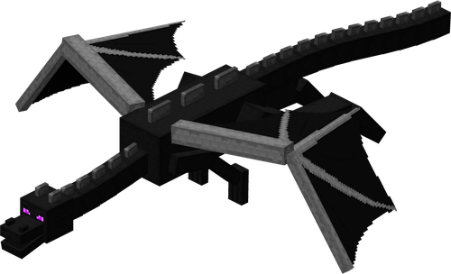

<p align="center">
  <a href="README.md"><strong>🇷🇺 Русский</strong></a> &nbsp;|&nbsp;
  <a href="README.en.md"><strong>🇬🇧 English</strong></a> &nbsp;|&nbsp;
  <strong>🇵🇱 Polski</strong>
</p>

<p align="center">
  
</p>

<h1 align="center">🎮 Trening loginu i hasła w stylu Minecraft</h1>

<p align="center">
  <strong>Interaktywna gra edukacyjna w autentycznym stylu Minecraft, pomagająca dzieciom w łatwy i przyjemny sposób zapamiętać login i hasło do swojego konta.</strong>
</p>

<p align="center">
  <a href="https://github.com/dzuyonak/password-trainer-minecraft/actions/workflows/build.yml">
    
  </a>
  
  
  
  
  
</p>

---

## 📑 Spis treści

- [✨ O projekcie](#-o-projekcie)
- [⚡ Szybki start](#-szybki-start)
- [🚀 Główne możliwości](#-główne-możliwości)
- [⚙️ Instrukcja konfiguracji](#️-instrukcja-konfiguracji)
  - [Opis parametrów](#opis-parametrów)
  - [Dla systemu Windows (config.ini)](#dla-systemu-windows-configini)
  - [Dla wersji Web (w przeglądarce)](#dla-wersji-web-w-przeglądarce)
- [🔒 Bezpieczeństwo danych i ostrzeżenia Windows SmartScreen](#-bezpieczeństwo-danych-i-ostrzeżenia-windows-smartscreen)
- [🎮 Przebieg rozgrywki](#-przebieg-rozgrywki)
- [🦁 Kolekcja postaci](#-kolekcja-postaci)
- [📁 Architektura i struktura plików](#-architektura-i-struktura-plików)
- [🛠️ Kompilacja ze źródeł](#️-kompilacja-ze-źródeł)
- [☁️ CI/CD i GitHub Pages](#️-cicd-i-github-pages)
- [🤝 Udział w projekcie](#-udział-w-projekcie)
- [📄 Licencja i Informacje prawne](#-licencja-i-informacje-prawne)

---

## ✨ O projekcie

Wiele dzieci napotyka trudności podczas logowania się do swojego konta Minecraft: zapominają o wielkości liter, mylą znaki lub denerwują się, gdy wpisywane hasło jest ukryte pod kropkami.

**Trening loginu i hasła w stylu Minecraft** przekształca żmudną naukę wpisywania hasła w ekscytujące wyzwanie:
- Dziecko trenuje wpisywanie loginu i hasła w dobrze znanym, lubianym interfejsie Minecrafta.
- Hasło jest domyślnie **jawne (otwarte)**, co pozwala dziecku kontrolować każdy krok i budować pewną pamięć mięśniową palców.
- Każde poprawne wpisanie danych odblokowuje nowego moba z Minecrafta (bez powtórek!).
- Zebranie wszystkich 15 postaci otwiera wspaniałą **Super Nagrodę** ze Smokiem Kresu, uroczystą fanfarą i Złotym Pucharem Znawcy!

---

## ⚡ Szybki start

| Platforma | Link | Opis | Wymagania systemowe |
| :--- | :--- | :--- | :--- |
| **Windows** | 📥 [**Pobierz MinecraftPasswordTrainer.exe**](https://github.com/dzuyonak/password-trainer-minecraft/raw/main/MinecraftPasswordTrainer.exe) | Samodzielny plik wykonywalny (~1 MB). Nie wymaga instalacji, uruchomienie dwuklikiem. | Windows 7, 8, 10, 11 (64-bit) |
| **Online (Web)** | 🌐 [**Otwórz w przeglądarce (GitHub Pages)**](https://dzuyonak.github.io/password-trainer-minecraft/?lang=pl) | Dostępne na każdym telefonie, tablecie, iPadzie lub komputerze bez pobierania. | Dowolna nowoczesna przeglądarka |
| **macOS / Linux** | `open index.html` lub `python3 app.py` | Wersja przeglądarkowa lub serwer Python z automatyczną synchronizacją `config.ini`. | Python 3.8+ (opcjonalnie) |

---

## 🚀 Główne możliwości

1. **📦 Całkowita samodzielność (Zero Dependencies)**:
   - Całość mieści się w jednym pliku binarnym o wielkości zaledwie **~1 MB**.
   - Wszystkie 15 grafik mobów, grafika Smoka Kresu, dźwięki i ikona diamentu są wbudowane w plik `.exe`.
   - Nie wymaga instalacji środowisk Python, Java, .NET Framework ani żadnych bibliotek.

2. **🌍 Wielojęzyczność w 1 kliknięcie (PL / EN / RU)**:
   - Obsługa trzech pełnych języków: **Polski** 🇵🇱, **English** 🇬🇧 oraz **Русский** 🇷🇺.
   - Płynna zmiana języka na żywo przyciskami w nagłówku: `[ PL ] [ EN ] [ RU ]`.
   - Całkowicie przetłumaczony interfejs, podpowiedzi, komunikaty błędów, ekran triumfu i opisy mobów.

3. **👁️ Domyślnie otwarte hasło**:
   - Hasło jest widoczne od razu po uruchomieniu, co jest kluczowe w procesie nauki pisania na klawiaturze.
   - W każdej chwili można kliknąć przycisk z okiem `[ 👁 ]` / `[ 🔒 ]`, aby ukryć hasło kropkami lub powrócić do tekstu.

4. **🎯 Duży interfejs przyjazny dzieciom (układ pionowy)**:
   - Elementy powiększone o 1.5x dla maksymalnego komfortu oczu dziecka.
   - Kursor od razu znajduje się w polu loginu.
   - Klawisz `Enter` płynnie przenosi kursor z loginu do hasła i zatwierdza formularz.

5. **⭐ 15 mobów z gwarantowanym postępem**:
   - Inteligentny algorytm bez powtórek: każde poprawne logowanie odblokowuje losowego moba z pozostałych zablokowanych.
   - Przejrzysty licznik: *«⭐ Odblokowane postacie: 7 z 15 (Pozostało: 8)»*.

6. **🏆 Wspaniała Super Nagroda**:
   - Po odblokowaniu wszystkich 15 postaci włącza się ekran triumfu:
     - Złoty świąteczny sztandar.
     - Grafika **Smoka Kresu** w cząstkach magii Kresu.
     - Osiągnięcie: *«[ LEGENDARNY MISTRZ MINECRAFT ]»*.
     - Nagroda: *«🥇 Złoty Puchar Znawcy Minecrafta!»*.
     - Uroczysta orkiestrowa fanfara zwycięstwa.
     - Przycisk szybkiego resetu, by w każdej chwili powtórzyć wyzwanie.

7. **🎵 Oprawa dźwiękowa**:
   - Dźwięk awansu doświadczenia (XP level-up) przy sukcesie.
   - Triumfalna fanfara po zebraniu całej kolekcji.
   - Łagodny dźwięk ostrzegawczy z podświetleniem ramki podpowiedzi w przypadku błędu.

---

## ⚙️ Instrukcja konfiguracji

### Opis parametrów

| Parametr | Wartości | Domyślnie | Opis |
| :--- | :--- | :--- | :--- |
| `login` | Dowolny tekst | `steve` | Prawidłowy login gracza do weryfikacji |
| `password` | Dowolny tekst | `diamond` | Prawidłowe hasło gracza do weryfikacji |
| `language` | `pl`, `en`, `ru` | `pl` | Język interfejsu aplikacji |
| `show_password` | `1` lub `0` | `1` | `1` — hasło domyślnie jawne, `0` — hasło ukryte kropkami |
| `show_hint` | `1` lub `0` | `1` | `1` — pokazuj podpowiedź na dole okna, `0` — ukryj |

---

### Dla systemu Windows (`config.ini`)

Obok pliku `MinecraftPasswordTrainer.exe` znajduje się plik tekstowy `config.ini`:

```ini
[Credentials]
; Wpisz prawidłowy login i hasło dziecka:
login = steve
password = diamond

[Options]
; Język interfejsu: pl (Polski), en (English), ru (Русский)
language = pl
; 1 = domyślnie pokazuj hasło jako jawny tekst, 0 = ukrywaj kropkami
show_password = 1
; 1 = pokazuj podpowiedź na dole okna, 0 = ukryj
show_hint = 1
```

> [!TIP]
> Plik `config.ini` można edytować w Notatniku w trakcie działania programu — zmiany zostaną załadowane automatycznie przy następnej próbie!

---

### Dla wersji Web (w przeglądarce)

1. Kliknij przycisk **`[ ⚙️ Ustawienia ]`** w prawym górnym rogu.
2. W oknie dialogowym ustaw login, hasło, język oraz widoczność podpowiedzi.
3. Kliknij **`💾 ZAPISZ`**. Ustawienia zostaną zapisane w pamięci przeglądarki (`localStorage`).

> [!NOTE]
> Przy uruchomieniu przez `python3 app.py` zmiany z przeglądarki zapisują się automatycznie do pliku `config.ini`.

---

## 🔒 Bezpieczeństwo danych i ostrzeżenia Windows SmartScreen

### 1. Ostrzeżenie dotyczące przechowywania haseł
> [!CAUTION]
> **Nie używaj prawdziwych haseł głównych!**  
> Konfiguracja jest zapisywana na Twoim urządzeniu w postaci jawnego tekstu (w pliku `config.ini` w systemie Windows oraz w `localStorage` przeglądarki), co ułatwia rodzicom konfigurację i naukę offline.  
> **Zalecenie:** Używaj dedykowanego hasła treningowego lub hasła do lokalnego profilu launchera. Nigdy nie wprowadzaj głównego hasła do kont rodziców, poczty e-mail, konta Microsoft/Xbox z podpiętymi kartami płatniczymi ani do bankowości!

### 2. Ostrzeżenia Windows SmartScreen i antywirusów (False Positives)
Aplikacja jest bezpłatnym projektem otwartoźródłowym (open-source) i nie posiada drogiego komercyjnego certyfikatu podpisu cyfrowego (EV Code Signing Certificate).

Ponieważ plik wykonywalny jest kompilowany za pomocą narzędzia Zig i zawiera pola wprowadzania loginu oraz hasła, filtry heurystyczne **Windows Defender SmartScreen** lub antywirusy mogą fałszywie sklasyfikować go jako nieznane oprogramowanie lub podejrzewać phishing/keylogger.

**Jak uruchomić aplikację w systemie Windows:**
1. Gdy pojawi się niebieski ekran informujący *„System Windows chronił ten komputer”* (SmartScreen):
2. Kliknij odnośnik tekstowy **„Więcej informacji”** (*More info*).
3. Kliknij przycisk **„Uruchom mimo to”** (*Run anyway*).
4. *(Alternatywnie)* Możesz uruchomić aplikację bezpośrednio w przeglądarce za pośrednictwem [GitHub Pages](https://dzuyonak.github.io/password-trainer-minecraft/) lub skompilować plik samodzielnie ze źródeł (`./build.sh`).

---

## 🎮 Przebieg rozgrywki

```
   ┌────────────────────────────────────────────────────────┐
   │ 1. EKRAN LOGOWANIA                                     │
   │    • Wprowadzenie loginu i hasła                       │
   │    • Przycisk z okiem do ukrywania/pokazywania         │
   │    • Podpowiedź prawidłowych danych na dole            │
   └──────────────────────────┬─────────────────────────────┘
                              │
               (Wpisanie poprawnych danych)
                              │
   ┌──────────────────────────▼─────────────────────────────┐
   │ 2. ODBLOKOWANIE POSTACI (1 z 15)                       │
   │    • Dźwięk doświadczenia (XP sound)                   │
   │    • Karta nowej postaci (grafika, klasa, opis)        │
   │    • Licznik postępu bez powtórek!                     │
   └──────────────────────────┬─────────────────────────────┘
                              │
               (Odblokowanie wszystkich 15 mobów)
                              │
   ┌──────────────────────────▼─────────────────────────────┐
   │ 3. SUPER NAGRODA: SMOK KRESU                           │
   │    • Triumfalna fanfara zwycięstwa                     │
   │    • Złoty Puchar Znawcy Minecrafta                    │
   │    • Przycisk ponownego startu gry                     │
   └────────────────────────────────────────────────────────┘
```

---

## 🦁 Kolekcja postaci

| Ikona | Postać | Klasa | Opis |
| :---: | :--- | :--- | :--- |
| 🧑 | **Steve** | Główny bohater | Legendarny odkrywca i budowniczy świata Minecraft! Gotowy na każdą przygodę. |
| 🏹 | **Alex** | Główna bohaterka | Odważna podróżniczka z łukiem i kilofem. Mistrzyni przetrwania w dzikich biomach! |
| 💥 | **Creeper** | Groźny potwór | Sss... BUM! Najsłynniejszy potwór w Minecrafcie. Bardzo boi się kotów! |
| 👁️ | **Enderman** | Wędrowiec Kresu | Wysoki mieszkaniec Kresu. Potrafi błyskawicznie się teleportować i przestawiać bloki! |
| 🧟 | **Zombie** | Nocny potwór | Niebezpieczny w ciemnościach i jaskiniach, lecz w porannym słońcu od razu płonie! |
| 💀 | **Szkielet** | Celny łucznik | Wprawny strzelec z łukiem. Za dnia ukrywa się w cieniu drzew lub w wodzie. |
| 🦾 | **Żelazny Golem** | Obrońca wioski | Potężny olbrzym z żelaznych bloków. Dzielnie broni osadników i wręcza im czerwone maki! |
| 🐺 | **Oswojony Wilk** | Wierny towarzysz | Najwierniejszy przyjaciel! Daj mu kość, a będzie dzielnie bronić cię przed każdym wrogiem. |
| 🐷 | **Świnka** | Łagodne zwierzę | Urocza świnka! Załóż na nią siodło i weź wędkę z marchewką, a wyruszysz na przejażdżkę! |
| 🐮 | **Krowa** | Łagodne zwierzę | Daje pożywne mleko w wiaderku, które natychmiast usuwa wszelkie negatywne efekty mikstur! |
| 🐑 | **Owca** | Łagodne zwierzę | Puszysta owieczka! Z jej wełny stworzysz przytulne łóżko, by bezpiecznie przespać noc. |
| 🛡️ | **Strażnik (Warden)** | Starożytny strażnik | Groźny, ślepy strażnik Starożytnego Miasta! Wyczuwa każdy krok i szelest poprzez wibracje. |
| 🐝 | **Pszczoła** | Pracowity mob | Urocza bzykająca pszczółka! Zapyla uprawy, zbiera nektar i napełnia ule pysznym miodem. |
| 🌊 | **Aksolotl** | Podwodny przyjaciel | Uroczy mieszkaniec bujnych jaskiń. Pomaga w walce pod wodą i potrafi udawać martwego! |
| 🦊 | **Lis** | Zwinny zwierzak | Uwielbia słodkie jagody, skacze wysoko po zdobycz i śpi przytulnie w śniegu zwinięty w kłębek. |

---

## 📁 Architektura i struktura plików

```text
├── MinecraftPasswordTrainer.exe   # Skompilowany plik binarny dla Windows (~1 MB)
├── index.html                     # Pełna wersja przeglądarkowa (HTML5 / Vanilla JS)
├── config.ini                     # Plik konfiguracyjny dla Windows EXE
├── config.js                      # Domyślny plik konfiguracyjny dla Web
├── app.py                         # Lokalny serwer Python z obsługą synchronizacji live-sync
├── main.cpp                       # Kod źródłowy C++ Win32 (GDI+ rendering, podwójne buforowanie)
├── generate_assets.py             # Generator tablic bajtowych zasobów (nagłówek C++)
├── assets_data.h                  # Plik nagłówkowy C++ z wbudowaną grafiką, dźwiękami i tekstami
├── build.sh                       # Skrypt kompilacji pod Windows przy użyciu Zig
├── assets/                        # Oryginalne zasoby multimedialne
│   ├── characters/                # 15 grafik postaci + super nagroda (PNG)
│   ├── sounds/                    # Dźwięki: success.wav, fanfare.wav, error.wav
│   └── app_icon.ico               # Ikona aplikacji (Diament z Minecrafta)
├── .github/
│   └── workflows/
│       └── build.yml              # CI/CD: Automatyczna kompilacja w chmurze GitHub Actions
├── LICENSE                        # Licencja MIT
├── README.md                      # Dokumentacja w języku rosyjskim (Русский)
├── README.en.md                   # Dokumentacja w języku angielskim (English)
└── README.pl.md                   # Dokumentacja w języku polskim (Polski)
```

---

## 🛠️ Kompilacja ze źródeł

Do kompilacji skrośnej pliku wykonywalnego Windows PE32+ wykorzystywany jest kompilator **Zig** (umożliwia budowanie bezpośrednio z macOS, Linuksa lub Windowsa):

### 1. Szybka kompilacja przez skrypt:
```bash
./build.sh
```

### 2. Kompilacja ręczna:
```bash
# 1. Generowanie nagłówka z zasobami:
python3 generate_assets.py

# 2. Kompilacja natywnej binarki Windows:
zig c++ -target x86_64-windows-gnu \
  -Wl,--subsystem,windows \
  -O2 \
  main.cpp \
  -lgdiplus -lole32 -lwinmm -luser32 -lgdi32 -lcomctl32 -lshlwapi \
  -o MinecraftPasswordTrainer.exe
```

---

## ☁️ CI/CD i GitHub Pages

1. **Automatyczna kompilacja w chmurze (GitHub Actions)**:
   Przy każdym pushu do gałęzi `main` uruchamia się proces [.github/workflows/build.yml](.github/workflows/build.yml). Kompiluje on najnowszy plik `MinecraftPasswordTrainer.exe` i dołącza go do artefaktów.

2. **Hosting wersji Web (GitHub Pages)**:
   - W ustawieniach repozytorium otwórz **Settings** ➔ **Pages**.
   - W sekcji **Branch** wybierz gałąź `main` oraz folder `/(root)`.
   - Kliknij **Save**.
   - Aplikacja będzie natychmiast dostępna pod adresem: `https://dzuyonak.github.io/password-trainer-minecraft/`.

---

## 🤝 Udział w projekcie

Wszelkie pomysły, zgłoszenia błędów i propozycje ulepszeń są mile widziane!
1. Wykonaj Fork repozytorium.
2. Utwórz gałąź dla swojej funkcji: `git checkout -b feature/AmazingFeature`.
3. Zapisz zmiany: `git commit -m 'feat: Add some AmazingFeature'`.
4. Wyślij gałąź na GitHub: `git push origin feature/AmazingFeature`.
5. Otwórz **Pull Request**.

---

## 📄 Licencja i Informacje prawne

### Licencja
Kod źródłowy projektu (pliki `.cpp`, `.py`, `.js`, `.html` oraz skrypty kompilacji) jest udostępniany na warunkach wolnej licencji **MIT License**. Szczegóły w pliku [LICENSE](LICENSE).

### Znaki towarowe i własność intelektualna Mojang
> [!IMPORTANT]
> **NOT AN OFFICIAL MINECRAFT PRODUCT. NOT APPROVED BY OR ASSOCIATED WITH MOJANG OR MICROSOFT.**  
> Minecraft jest zarejestrowanym znakiem towarowym Mojang AB / Microsoft Corporation. Nazwa Minecraft, oryginalne grafiki mobów, efekty dźwiękowe oraz styl graficzny należą do Mojang AB i Microsoft Corporation i są wykorzystywane wyłącznie w niekomercyjnych celach edukacyjnych i hobbystycznych. Projekt nie jest oficjalnym produktem Minecraft i nie jest powiązany z firmą Mojang ani Microsoft.
